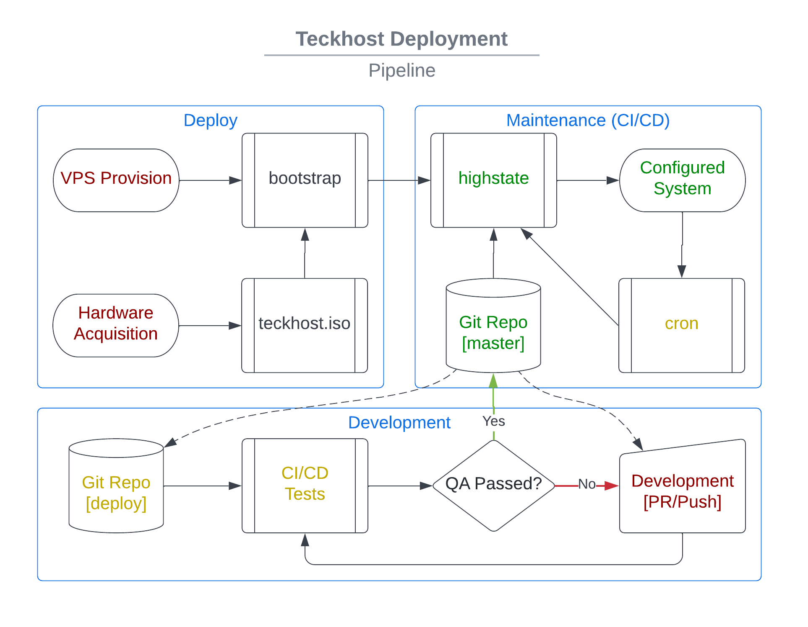

.. figure:: https://github.com/MTecknology/teckhost/actions/workflows/cicd.yml/badge.svg?branch=deploy
    :target: https://github.com/MTecknology/teckhost/actions/workflows/cicd.yml
    :alt: CI/CD

.. figure:: https://img.shields.io/github/issues/MTecknology/teckhost.svg
    :target: https://github.com/MTecknology/teckhost/issues
    :alt: Github Issues

.. _teckhost:

MTecknology Host
================

This repository is used to automate the building, testing, deployment, and
maintenance of servers and endpoints that are managed by MTecknology.

Primary Goals:

- Provide a `Salt Bootstrap <bootstrap>`_ to get a system "enrolled" into
  teckhost management
- Provide a bare metal installer, similar to debian-installer
- Automatically run a full CI/CD (build+install+validate) pipeline on any change

Secondary Goals:

- Provide the ability to test with local file system changes
- Limit user interaction to env (wifi, hostname) and encryption questions
- Implement CI/CD release process to automatically promote after tests pass
- Provide automated "release" of all "static assets" (teckhost.iso, bootstrap)

Deployment
----------

VPS:

1. Implement Salt-Cloud (or manually create)
2. Log in and run `Salt Bootstrap <bootstrap>`_
3. Provide keys

Bare Metal:

1. `Download`_ OR `Build ISO <build-iso>`_ 
2. Copy ISO to flash drive (with ``mbuffer`` or ``dd``)
3. Boot to installer and choose either LVM or Encrypted
4. Provide network/hostname/keys

.. _Download: https://github.com/MTecknology/teckhost/releases

.. _bootstrap:

Salt Bootstrap
--------------

Salt is at the core of deployment and maintenance. Package selection, user
creation, security policies, etc. is all done by salt during a
`state.highstate`_. The ultimate goal of this ``./bootstrap`` script is to run
the ``highstate`` as soon as safely possible.

In order for this ``./bootstrap`` script to complete, it will need to prompt for
a passphrase to decrypt salt's `Encrypted Data <encryption>_` keys.

To run the bootstrap::

    wget https://raw.githubusercontent.com/mtecknology/teckhost/master/bootstrap
    bash bootstrap

.. _encryption:

Encrypted Data
~~~~~~~~~~~~~~

In order to read encrypted "pillar" data, salt needs access to a gpg key; this
is stored in this repository in an encrypted blob. The ``Salt Bootstrap`` script
will expect the user to have access to this private key in order to decrypt the
blob.

Ideally, only pre-hashed values will be stored in pillar. For example, a
password hash generated with ``crypt`` is encrypted for salt, rather than the
password itself.

To encrypt a password suitable for usage in pillar data::

    # Import the public key
    gpg --import teckhostpub.gpg

    # Pipe the secret data through gpg
    echo -n 'S3cr!t' | gpg --trust-model always -ear salt@teckhost.lustfield.net

.. _state.highstate: https://docs.saltproject.io/en/latest/topics/tutorials/states_pt1.html
