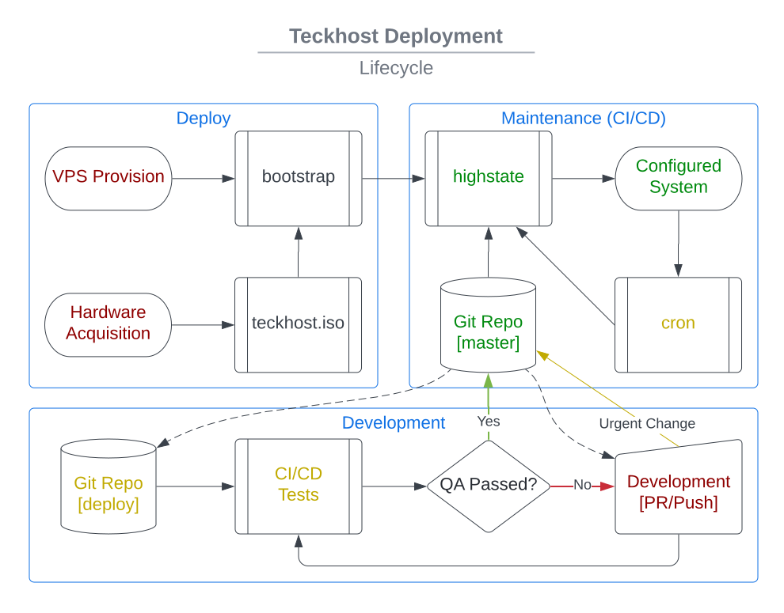

- Build: |cicd-init|
- Issues: |issues|

.. _teckhost:

MTecknology Host
================

This repository is used to automate the building, testing, deployment, and
maintenance of servers and endpoints that are managed by MTecknology (Mike L.).

Primary Goals:

- Provide a :ref:`bootstrap script <bootstrap>` to get a system "enrolled" into
  teckhost management
- Provide a bare metal installer, similar to debian-installer
- Automatically run a full CI/CD (build+install+validate) pipeline on any change

Secondary Goals:

- Provide the ability to test with local file system changes
- Limit user interaction to env (wifi, hostname) and encryption questions
- Implement CI/CD release process to automatically promote after tests pass
- Provide automated "release" of all "static assets" (teckhost.iso, bootstrap)

Deployment
----------

VPS:

1. Implement Salt-Cloud (or manually create)
2. Log in and run :ref:`Salt Bootstrap <bootstrap>`
3. Provide keys

Bare Metal:

1. `Download`_ or :ref:`Build <build-iso>` ISO
2. Copy ISO to flash drive (with ``mbuffer`` or ``dd``)
3. Boot to installer and choose either LVM or Encrypted
4. Provide network/hostname/keys

.. _bootstrap:

Salt Bootstrap
--------------

Salt is at the core of deployment and maintenance. Package selection, user
creation, security policies, etc. is all done by salt during a
`state.highstate`_. The ultimate goal of this ``./bootstrap`` script is to run
the ``highstate`` as quickly and safely as possible.

In order for this ``./bootstrap`` script to complete, it will need to prompt for
a passphrase to decrypt salt's :ref:`Pillar Data <pillar>` keys.

To run the bootstrap::

    wget https://raw.githubusercontent.com/mtecknology/teckhost/master/bootstrap
    bash bootstrap

.. _pillar:

Pillar Data
~~~~~~~~~~~

In order to read encrypted "pillar" data, salt needs access to a gpg key; this
is stored in this repository in an encrypted blob. The :ref:`Salt Bootstrap
<bootstrap>` script will expect the user to have access to this private key in
order to decrypt the blob.

Ideally, only pre-hashed values will be stored in pillar. For example, a
password hash generated with ``crypt`` is encrypted for salt, rather than the
password itself. *This repository is highly exposed and nothing within, even
encrypted, should be considered more secure than the test data.*

To encrypt data for pillar::

    # Import the public key
    curl -s https://raw.githubusercontent.com/MTecknology/teckhost/master/pillar/teckhost.pub | gpg --import

    # Pipe the secret data through gpg
    echo -n 'S3cr!t' | gpg --trust-model always -ear salt@teckhost.lustfield.net

.. _Download: https://github.com/MTecknology/teckhost/releases

.. _state.highstate: https://docs.saltproject.io/en/latest/topics/tutorials/states_pt1.html

.. |cicd-release| image:: https://github.com/MTecknology/teckhost/actions/workflows/cicd.yml/badge.svg?branch=cicd-release
    :target: https://github.com/MTecknology/teckhost/actions/workflows/cicd.yml
    :alt: CI/CD

.. |cicd-init| image:: https://github.com/MTecknology/teckhost/actions/workflows/cicd.yml/badge.svg?branch=master
    :target: https://github.com/MTecknology/teckhost/actions/workflows/cicd.yml
    :alt: CI/CD

.. |issues| image:: https://img.shields.io/github/issues/MTecknology/teckhost.svg
    :target: https://github.com/MTecknology/teckhost/issues
    :alt: Github Issues

Testing
-------

The best place to start learning about test processes is either ``Makefile`` or
``.github/workflows/*``.

Quick Commands
~~~~~~~~~~~~~~

- ``make test``: Run limited set of tests inside of a podman container
- ``make full-test``: Run ALL (user, admin) tests inside of a virtualbox VM

Disk Space
~~~~~~~~~~

Disk space used to test a Debian 12 VM:

- ``<repo>/*.iso``: (-> 1.3 GB)

  + ``upstream_debian12.iso``: Original Debian ISO
  + ``teckhost_debian12.iso``: Remastered ISO

- ``~/VirtualMachines/testpc1/``: (-> 13 GB)

Disk space used to test a Debian 12 Container:

- ``~/.local/share/containers/storage/vfs/dir/``: (-> 11 GB)

  + ``podman build tpod_debian`` reaches 5.4 GB max size -> yields 4.4 GB image
  + ``podman run tpod_debian Dockertest.sh`` reaches 5.6 GB

- ``/var/tmp``: Image commit at end of ``podman build`` reaches ~7.8 GB (-> 0 GB)

Ultimately, both approaches require approximately 14 GB of disk space.
